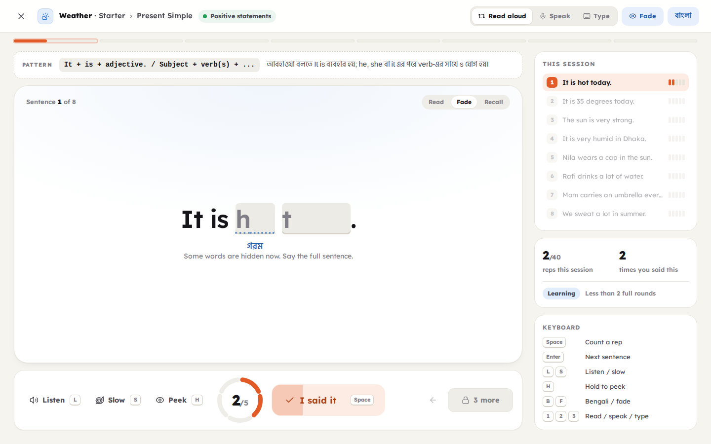

# Repetition English

Learn English by repetition. Built for Bengali speakers.

Every sentence is said several times. Words fade from the screen with each
repetition, so the last one comes from memory. Finished sessions come back
after 1, 3, 7, 14, 30 and 60 days. Content is organized by topic and never
mixes grammar or sentence types inside a session.



## What is inside

- **4 levels:** Starter (A1), Elementary (A2), Intermediate (B1), Advanced (B2–C1)
- **6 topics:** Weather, Household Chores, Office, Daily Routine, Food & Cooking, Shopping
- **24 story-based tracks, 432 sessions, 2,460 sentences and paragraphs, 4,785 word meanings in Bengali**
- **3 practice modes:** Read aloud (with a pace guard), Speak (the mic checks each rep), Type
- **Memory Fade**, strict rep lock, chain rounds, spaced review, streaks and a progress dashboard
- Bengali on/off with one key (`B`). Tap any dotted word for its meaning.

## Run it

```bash
npm install
npm run dev          # http://localhost:5173
```

Speak mode needs Chrome or Edge. Everything else works in any modern browser.

| Script | What it does |
|---|---|
| `npm run dev` | Start the dev server |
| `npm run build` | Typecheck and build to `dist/` (works on any static host) |
| `npm run preview` | Serve the production build |
| `npm run validate:data` | Check every lesson file against the content rules |

## Project layout

```
data/
  catalog.json               levels, topics, labels, and the blueprint for every level
  topics/<topic>/<level>.json  lesson content (one track per file)
docs/
  DESIGN.md                  full application design
  CONTENT_GUIDE.md           rules for writing lesson content
  screenshots/
scripts/validate-data.mjs    content validator
src/
  pages/                     Today, Library, Track, Practice, Review, Progress, Settings
  components/                Sentence (fade + word meanings), layout, UI parts
  lib/                       content loading, progress store, spaced review, speech, text matching
  styles/                    design tokens and styles
```

## Docs

- [Application design](docs/DESIGN.md): principles, content model, repetition engine, every screen, visual system
- [Content guide](docs/CONTENT_GUIDE.md): how to add a topic or a level

## Status

Laptop version (1280 px and wider). Progress is saved in the browser; use
Settings → Export to move it. Mobile layout and accounts are next.
