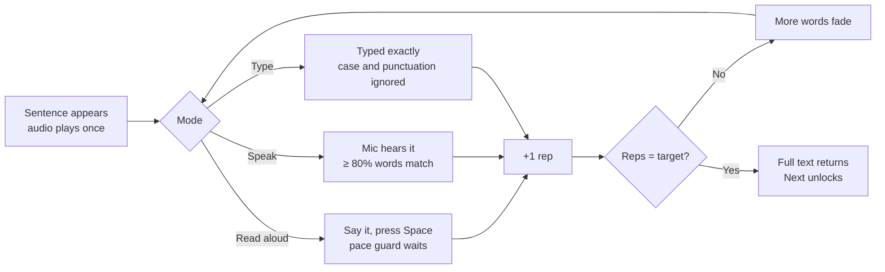
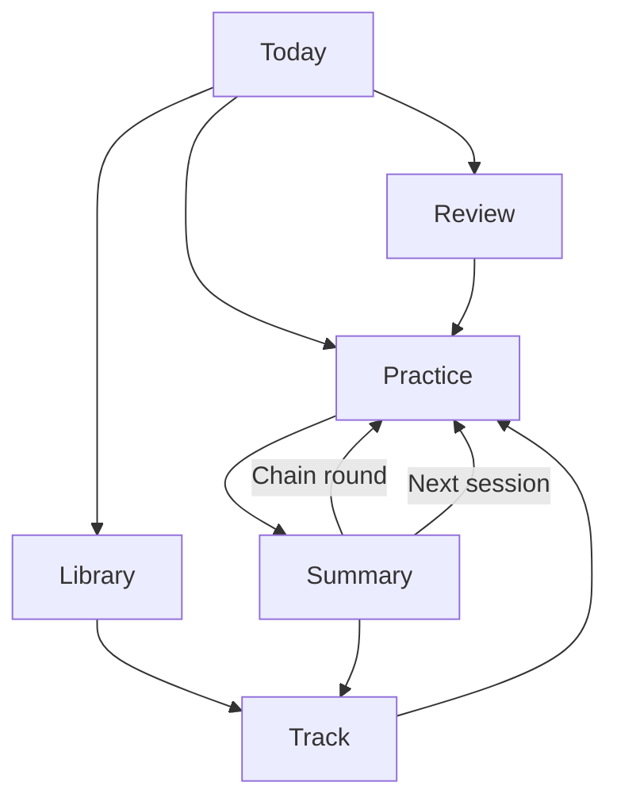
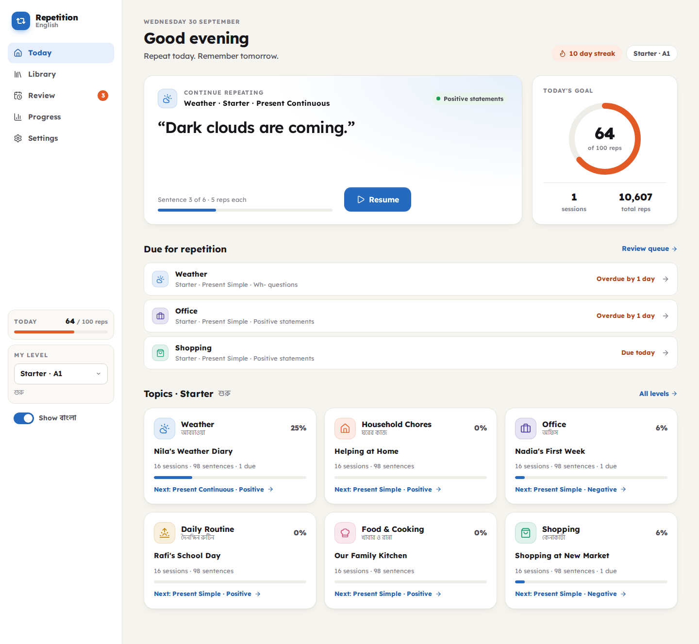
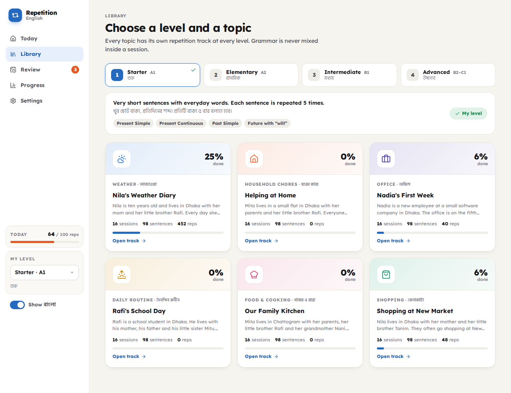
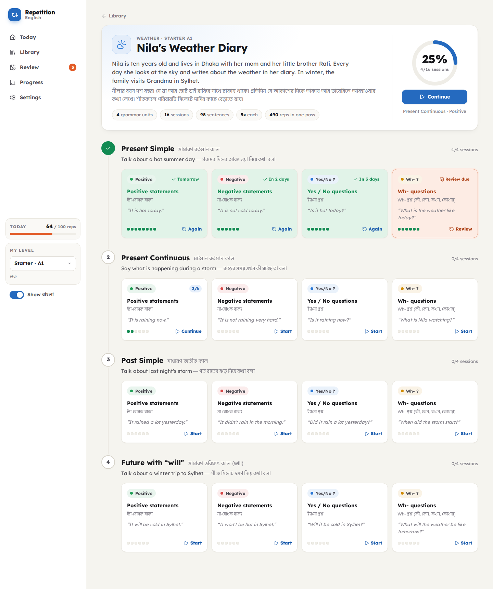
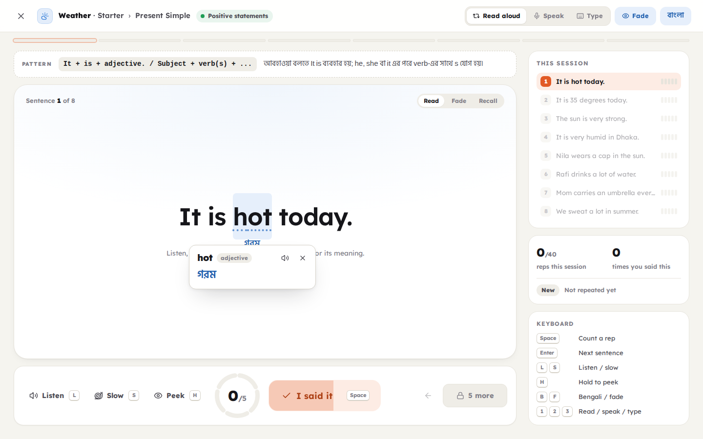
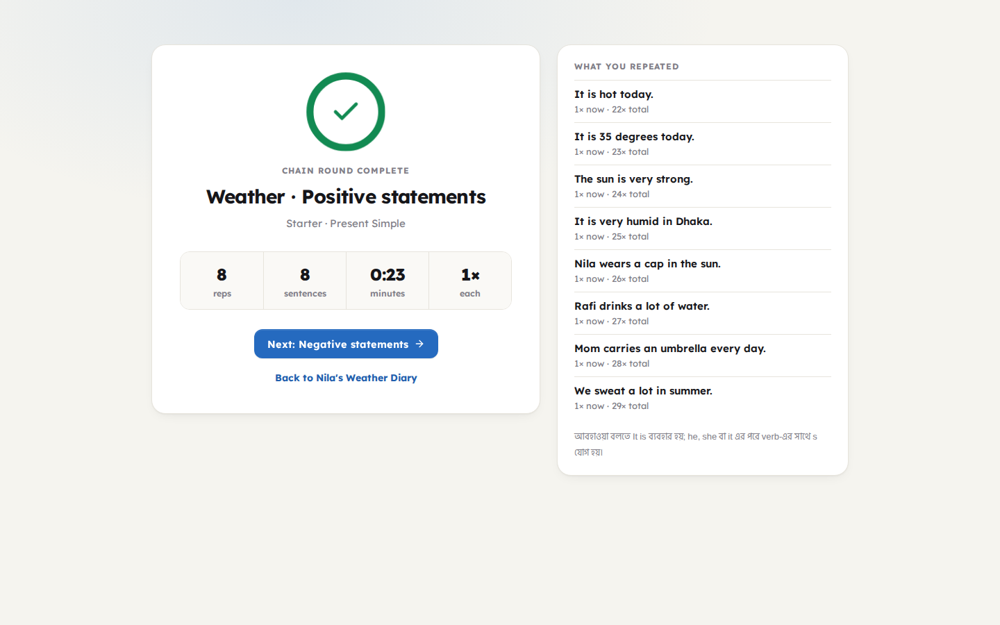
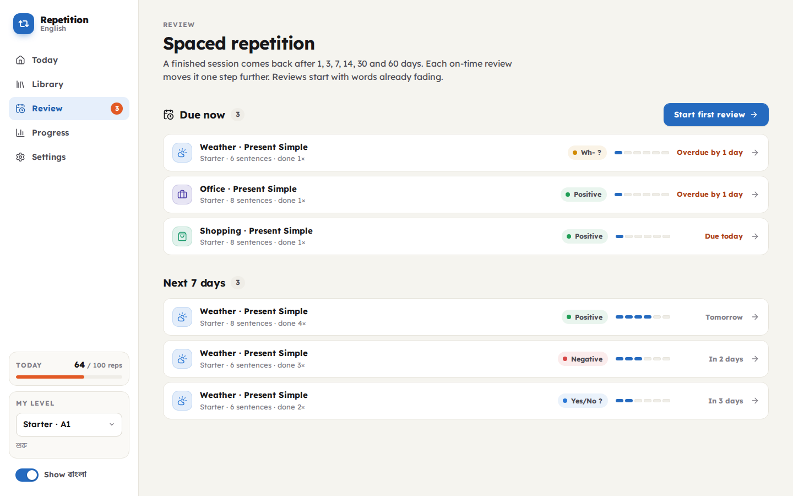

# Repetition English — Application Design (laptop)

Repetition English teaches English to Bengali speakers through **topic-based,
structured repetition**. Every sentence is said several times, words fade from
the screen with each repetition, and finished sessions come back on a spaced
schedule. The content never mixes grammar or sentence types inside a session.

This document covers the laptop version (1280 px and wider). Mobile is out of
scope for now.


---

## 1. Principles

| # | Principle | What it means in the product |
|---|---|---|
| 1 | **Repetition is the product** | Every screen counts reps. A rep is one time you say, type or recall a sentence. |
| 2 | **Forced, but fair** | "Next" stays locked until the last rep. A pace guard stops button mashing. Speak and Type modes verify the rep. |
| 3 | **One thing at a time** | A session is one grammar focus × one sentence type. Negative sessions hold only negatives. Question sessions hold only questions. |
| 4 | **Story, not random sentences** | Each track follows one small story with the same people and places, so meaning carries from sentence to sentence. |
| 5 | **Many ways to say it** | A topic is covered from many angles: "It is hot today", "It is 35 degrees", "The sun is very strong". |
| 6 | **Words, not translations** | No full sentence translations. Difficult words carry a Bengali meaning you can tap. |
| 7 | **Bengali is a scaffold** | One switch (`B`) shows or hides all Bengali: word hints, titles, grammar tips. |
| 8 | **Recall beats reading** | Memory Fade hides more words on each rep. The last rep is from memory. |

---

## 2. Content model

```
Level (Starter → Advanced)
 └─ Topic (Weather, Office, ...)
     └─ Track = one topic at one level       data/topics/<topic>/<level>.json
         └─ Unit = one grammar focus          e.g. Past Simple
             └─ Session = one sentence type   e.g. Negative statements
                 └─ Item = one sentence or one short paragraph
                     └─ words[] = difficult words with Bengali meaning
```

### Levels

| Level | CEFR | Reps per sentence | Sentence length | Grammar units (in order) |
|---|---|---|---|---|
| Starter | A1 | 5 | 3–7 words | Present Simple · Present Continuous · Past Simple · Future (will) |
| Elementary | A2 | 4 | 5–10 words | Present Simple · Present Continuous · Past Simple · Future (going to) |
| Intermediate | B1 | 3 | 8–16 words + paragraphs | Present Perfect · Past Continuous · Modals · Conditionals (1st, 2nd) |
| Advanced | B2–C1 | 3 | 12–25 words + paragraphs | Present Perfect Continuous · Past Perfect · Passive · Conditionals (3rd, mixed) |

### Session types (never mixed)

| Type | Example (Weather) |
|---|---|
| Positive statements | It is hot today. |
| Negative statements | It is not cold today. |
| Yes / No questions | Is it hot today? |
| Negative questions | Doesn't it rain a lot in Sylhet? |
| Wh- questions | What is the weather like today? |
| Tag questions | We should leave early because of the fog, shouldn't we? |
| Polite & indirect questions | Could you tell me how the daily forecast is prepared at the weather office? |
| Short paragraphs | "A long dry spell": It hasn't rained in Rajshahi for five weeks, and the temperature has stayed above 40 degrees. ... |

The exact structure per level (units, session types, item counts) is the
`blueprint` in [`data/catalog.json`](../data/catalog.json). Authors follow
[`CONTENT_GUIDE.md`](CONTENT_GUIDE.md); `npm run validate:data` checks it.

### Current content

| | Starter | Elementary | Intermediate | Advanced |
|---|---|---|---|---|
| Weather | Nila's Weather Diary | Two Cities, Six Seasons | The Weather Desk | Living with a Changing Climate |
| Household Chores | Helping at Home | The Weekly Chore Chart | A New Home in Dhanmondi | Four Roommates in Toronto |
| Office | Nadia's First Week | Tanvir and the Marketing Team | Sabrina's Project Team | Leading an International Team |
| Daily Routine | Rafi's School Day | Nadia's Busy Days | Tanvir's New Routine | A Remote Life in Toronto |
| Food & Cooking | Our Family Kitchen | Saturday Cooking Class | Cooking Away From Home | Samira's London Kitchen |
| Shopping | Shopping at New Market | Getting Ready for Eid | The Corner Shop | A Smart Shopper Abroad |

**24 tracks · 432 sessions · 2,460 items · 4,785 glossed words.** Each track
has 98–108 items. Office paragraphs are real workplace texts: status updates,
client replies, meeting notes and formal requests.

---

## 3. The repetition engine

### 3.1 One item, step by step



### 3.2 Rules

| Mechanic | Rule |
|---|---|
| **Target reps** | Starter 5, Elementary 4, Intermediate 3, Advanced 3. Review runs use `max(2, target − 2)`. A chain round uses 1. |
| **Strict lock** | "Next" shows a lock and "N more" until the target is met. Extra reps are allowed and counted. Can be turned off in Settings. |
| **Pace guard** | In Read-aloud mode the rep button unlocks after about the time needed to say the text (0.38 s per word, 1.1–20 s). A fill bar shows the wait. |
| **Memory Fade** | Hidden share after `d` reps of target `n` = `d / (n − 1)`. Starter: 0% → 25% → 50% → 75% → 100%. Glossed words fade first, then long words. Partly hidden words keep their first letter; the last rep hides everything. Reviews start at 50%. Hold `H` or hover to peek. |
| **Stage indicator** | Read → Fade → Recall pill above the sentence. |
| **Speak mode** | Web Speech API (Chrome, Edge). Contractions and numbers are normalized ("it's" = "it is", "30" = "thirty"). A rep counts at ≥ 80% word match (LCS). |
| **Type mode** | Exact word match after normalization. Wrong words are shown struck through. |
| **Chain round** | After a session: say every item once, 75% faded. It adds reps but does not move the review schedule. |
| **Resume** | An unfinished session keeps its counts and position. "Continue" on Today takes you back to the exact sentence. |

### 3.3 Spaced review

A finished session enters a review box. On-time reviews move it up one box.
Early practice keeps the box.

| Box | 1 | 2 | 3 | 4 | 5 | 6 |
|---|---|---|---|---|---|---|
| Next review after | 1 day | 3 days | 7 days | 14 days | 30 days | 60 days |

### 3.4 Mastery (per sentence)

Measured in rounds, where one round = the level's target reps.

| New | Learning | Familiar | Strong | Mastered |
|---|---|---|---|---|
| 0 reps | < 2 rounds | 2–3 rounds | 4–5 rounds | 6+ rounds |

---

## 4. Screens

Navigation: a fixed left sidebar (Today, Library, Review, Progress, Settings,
today's reps, level picker, Bengali switch). Practice opens in a full-screen
focus mode with no sidebar.



### Today
Continue card with the exact sentence you stopped at, daily goal ring, streak,
"Due for repetition" list, and the six topics at your level. New users see a
four-step "how it works" strip.



### Library
Four level tabs (with CEFR and Bengali name), the grammar units of that level,
and one card per topic track with its story, counts and progress.



### Track
The story (English and Bengali), counts, and a vertical ladder of grammar
units. Each unit shows its session cards: type chip, first sentence preview,
per-item progress pips and status (Start, Continue 3/6, Done · review in 2
days, Review due).



### Practice (focus mode)
- **Top bar:** exit, breadcrumb, sentence type chip, mode switch
  (Read aloud / Speak / Type), Fade and বাংলা toggles.
- **Progress strip:** one segment per item, filled by reps.
- **Pattern card:** the sentence formula (`Did + subject + verb ...?`) and a
  one-line Bengali tip.
- **Stage:** the sentence in large type with dotted difficult words and
  Bengali hints under them. Tap a word for its card: word, part of speech,
  base form, Bengali meaning, listen button.
- **Control bar:** Listen, Slow, Peek · segmented rep ring (`3/5`) · big rep
  button · Previous and locked Next.
- **Side rail:** all items with rep pips, reps this session, lifetime reps
  for this sentence, mastery badge, keyboard map.

| Word meaning | Fading | Done |
|---|---|---|
|  |  |  |

Paragraph sessions use the same screen with left-aligned reading text:


### Summary
Reps, items, time, reps per item, the next review date, and two next steps:
a chain round or the next session.



### Review
Due now, next 7 days, and later, each with its box progress.



### Progress
Total reps (the one hero number), today, streak, best day, mastered count; a
daily reps heatmap; mastery distribution at your level; reps by topic; most
repeated sentences.


### Settings
Level, daily goal, default mode, strict lock, pace guard, memory fade,
Bengali, voice and speed, auto-play, theme, export / import / reset.

---

## 5. Keyboard

| Key | Action |
|---|---|
| `Space` | Count a rep (Read aloud) |
| `Enter` / `→` | Next item (when unlocked) |
| `←` | Previous item |
| `L` / `S` | Listen / listen slowly |
| `H` (hold) | Peek at hidden words |
| `M` | Mic on / off (Speak) |
| `B` | Show / hide Bengali |
| `F` | Memory Fade on / off |
| `1` `2` `3` | Read aloud / Speak / Type |
| `Esc` | Close word card, or exit the session |

---

## 6. Visual design

| Token | Light | Dark | Use |
|---|---|---|---|
| Page | `#f5f4ef` | `#0f0f12` | Warm paper background |
| Surface | `#ffffff` | `#18181c` | Cards |
| Ink | `#16161a` | `#f2f1ec` | Text |
| Primary | `#256abf` | `#2f6fd0` | Navigation, buttons, links |
| Rep | `#e25a26` | `#e0602f` | Everything that counts a repetition |
| Good | `#128a52` | `#2fb574` | Completed reps and sessions |

- **Type:** Lexend (designed for reading fluency) for English; Hind Siliguri
  for Bengali. Sentence sizes step down by length: 50 / 40 / 31 px, 22 px for
  paragraphs.
- **Topic colors** tint icons and card headers only (Weather blue, Chores
  orange, Office violet, Routine amber, Food pink, Shopping green).
- **Sentence type colors** appear as a dot in the type chip, so identity never
  relies on color alone.
- **Charts** use one sequential blue ramp (heatmap) and ordinal blue steps
  (mastery). Dark mode has its own validated steps.
- **Motion:** words fade over 0.4 s, the rep ring pops on each rep, the pace
  bar fills. All motion respects `prefers-reduced-motion`.
- Light, dark and system themes.


---

## 7. Data and storage

| What | Where |
|---|---|
| Levels, topics, labels, blueprint | `data/catalog.json` |
| Lesson content | `data/topics/<topic>/<level>.json` |
| Authoring rules | `docs/CONTENT_GUIDE.md` |
| Validation | `scripts/validate-data.mjs` (structure, counts, sentence type rules, glossed words present in the sentence, Bengali present) |
| Learner progress | `localStorage` key `repetition-english:v1` |

Progress state:

```ts
{
  v: 1,
  items:    { "<topic>/<level>/<grammar>/<type>/<id>": { reps, last } },
  sessions: { "<topic>/<level>/<grammar>/<type>": { completions, lastCompleted, box, due } },
  attempts: { "<session key>": { counts: number[], index, startedAt, updatedAt } },
  days:     { "YYYY-MM-DD": reps },
  settings: { level, showBangla, fade, mode, dailyGoal, strict, paceGuard, autoListen, voice, rate, theme }
}
```

Export and import move progress between laptops until accounts exist.

---

## 8. Tech

- React 19, TypeScript, Vite, React Router (hash routing, so `dist/` runs on
  any static host).
- Web Speech API for text-to-speech and recognition. No backend.
- Self-hosted fonts via Fontsource, so the app works offline after load.
- Lesson JSON is bundled into its own `content` chunk.

---

## 9. Next steps

1. **Mobile layout** (the stage and control bar stack; the side rail becomes a sheet).
2. **Accounts and sync** so progress follows the learner.
3. **Recorded human audio** for natural stress and intonation.
4. **Shadowing mode:** audio plays, a pause for the learner, repeat, hands-free.
5. **More topics:** travel, health, school, phone calls, bank and money.
6. **Pronunciation feedback** per word in Speak mode.
