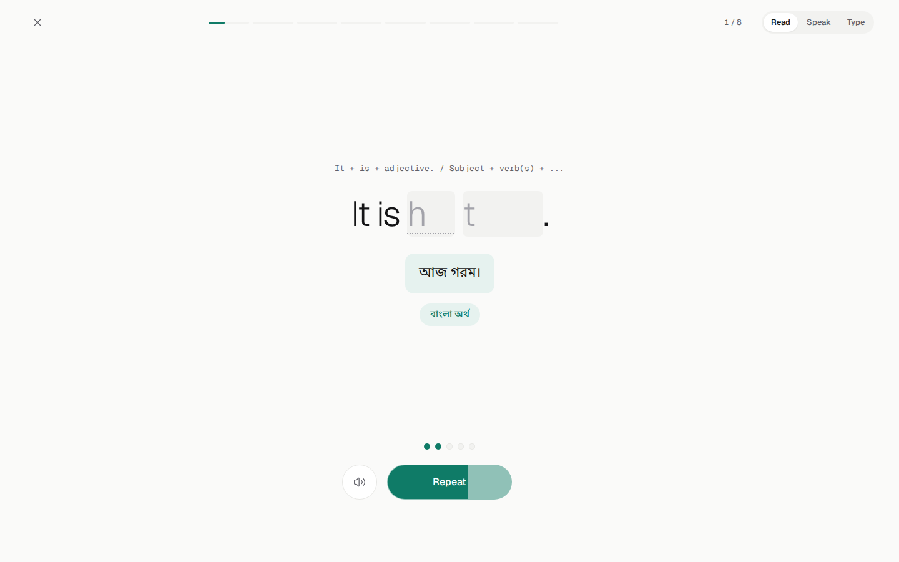
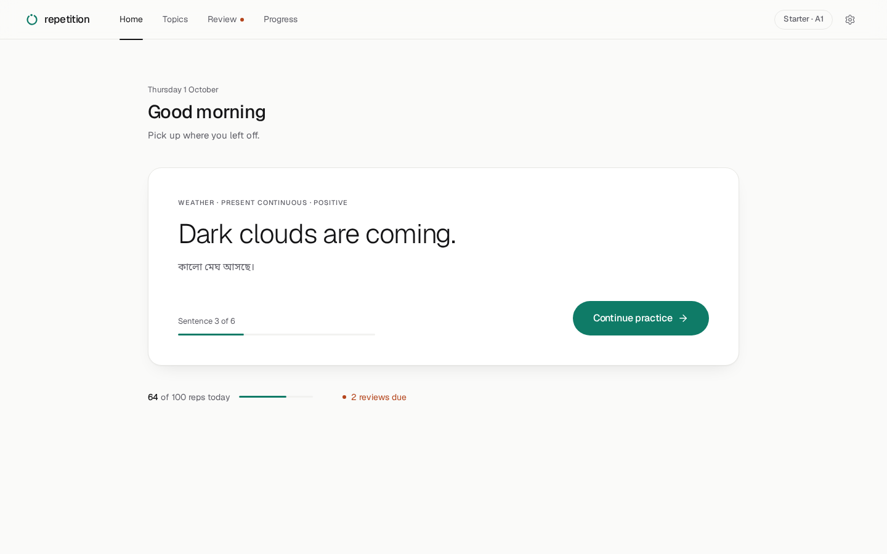
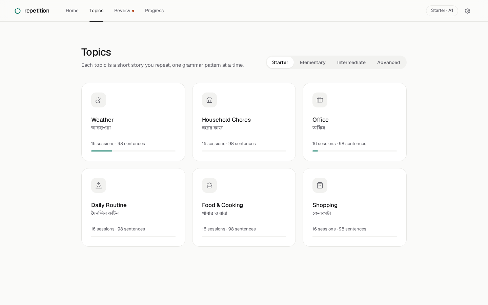
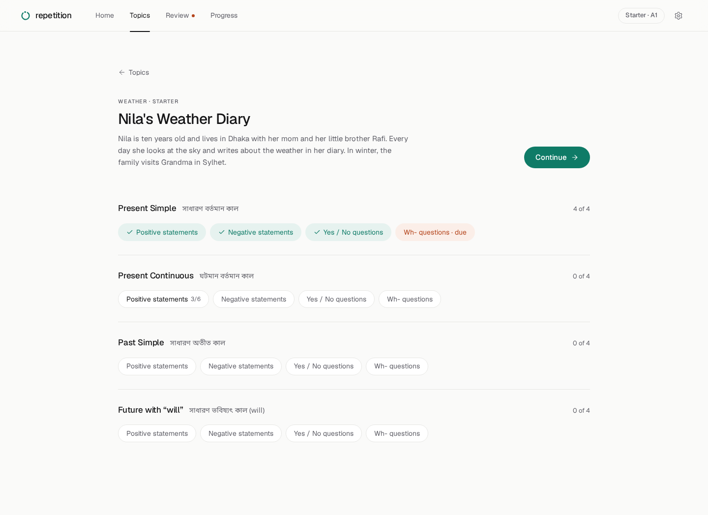
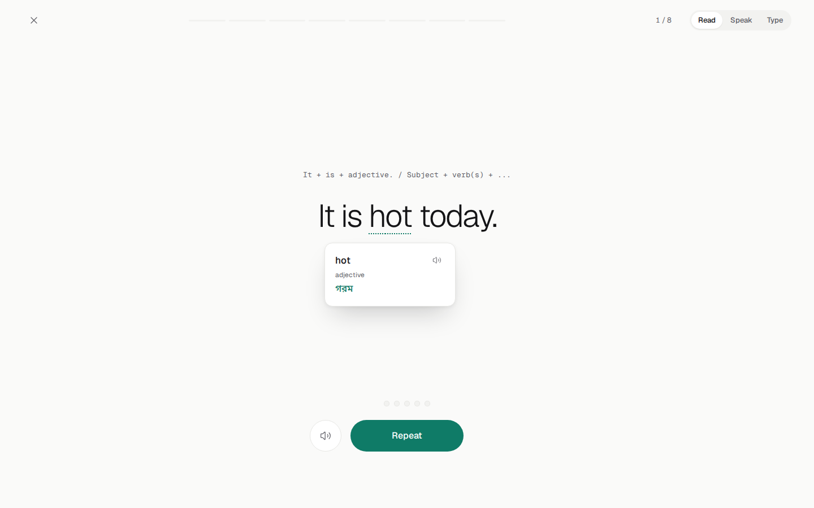
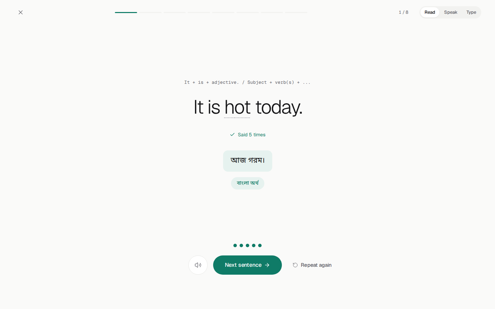
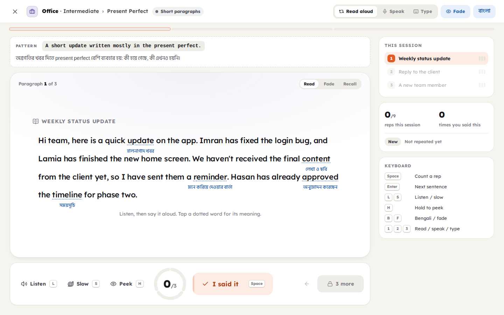
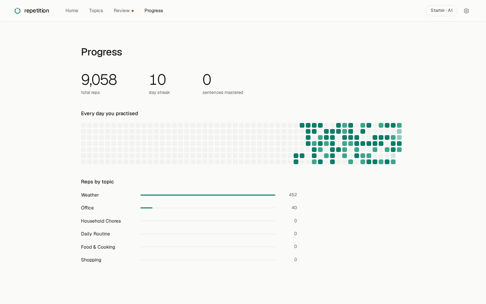
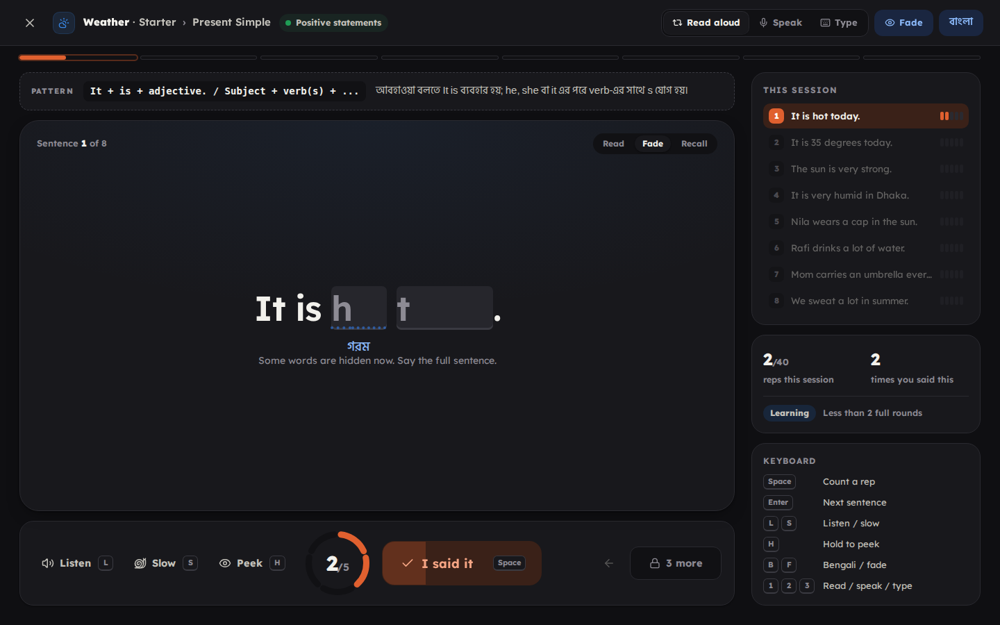

# Repetition: application design (laptop)

Repetition is a quiet English practice app for Bengali speakers. It has one
idea: say a sentence again and again until it stays. Every screen serves that
idea and nothing else.



## 1. Design framework

The design was set up before the code, in two Claude Design artifacts:

| Artifact | What it holds |
|---|---|
| [Repetition design system](https://claude.ai/artifact/SWfmv2g4zojanvwvbFo45a) | Brand book, tokens (color in light and dark, type scale, spacing, radius, shadow), 9 components with live previews, the logo mark |
| [Repetition app screens](https://claude.ai/artifact/9fhg7Gpoqe8rciui5yXvhH) | 8 laptop screens: Home, Topics, Topic, three Practice states, Summary, Progress |

Both are private until shared from their Share menu. The code follows them
exactly: `src/styles/tokens.css` mirrors the design system's `tokens.json`.

## 2. Brand

- **Name:** Repetition. Wordmark: the loop mark plus lowercase `repetition` in Geist 500.
- **Mark:** a ring with a small gap and one bead in it, the moment of "one more time".
- **Tagline:** Say it again. And again. Until it stays.
- **Voice:** calm, short, second person. Sentence case. No exclamation marks, no emoji.

## 3. Principles

| # | Principle | In the product |
|---|---|---|
| 1 | One thing per screen | Each screen has one title, one primary action and one job |
| 2 | The sentence is the hero | In practice, the English sentence is the largest and lightest thing on screen |
| 3 | Bengali on request | The full-sentence meaning appears when you tap **বাংলা অর্থ**; a word meaning appears when you tap a dotted word |
| 4 | Light type, generous space | The heaviest weight anywhere is 500 |
| 5 | Calm motion | Things fade and rise into place; nothing bounces or flashes |
| 6 | No shortcuts to learn | Everything is a visible button. There are no keyboard shortcuts |

## 4. Visual system

| Token | Light | Dark | Use |
|---|---|---|---|
| `canvas` | `#fafaf9` | `#0c0c0e` | Page |
| `surface` | `#ffffff` | `#151518` | The one card that matters |
| `surface-sunk` | `#f2f2f0` | `#1d1d21` | Tracks, hidden-word slots |
| `ink` | `#141416` | `#f2f2f0` | Text |
| `ink-muted` | `#5f5f67` | `#a3a3ab` | Secondary text |
| `accent` | `#0f7b67` | `#3ccfae` | Repetition: rep dots, progress, the primary button |
| `accent-soft` | `#e6f2ef` | `#0f2c26` | The revealed meaning, completed sessions |
| `signal` | `#b4441b` | `#f08a5d` | Due reviews only, always with a word |

- **Type:** Geist (300–500) for English, Noto Sans Bengali for Bengali, Geist Mono for the grammar pattern line.
- **Sentence sizes:** 56px (up to 8 words), 42px (9–16), 32px (17+), 22px for paragraphs, all weight 300–350.
- **Shape:** cards 22px radius, rows 14px, buttons and pills fully round. Borders are 1px; shadows only on the continue card, hovered tiles and popovers.
- **One accent.** Topics are told apart by icon and name, not by color.

## 5. Motion

Built with [Motion](https://motion.dev) for React.

| Moment | Animation |
|---|---|
| Screen entrance | Fade in and rise 8px, 480ms, ease-out-quint |
| Lists (topics, units, reviews) | Items rise in one after another, 40ms apart |
| Nav and segmented pickers | The active underline or pill slides to the new choice |
| Each rep | The next dot springs in; words fade into their hidden slots over 400ms |
| Pace guard | The Repeat button fills from left to right while you say the sentence |
| Next sentence | The current item slides out left, the next slides in from the right |
| বাংলা অর্থ | The meaning opens downward (height and opacity, 280ms) |
| Word meaning | The popover fades and rises 4px, 160ms |
| Session complete | A ring draws itself, then the check, then the figures fade in |

All motion respects `prefers-reduced-motion`.

## 6. Content model

```
Level (Starter → Advanced)
 └─ Topic (Weather, Office, ...)
     └─ Track = one topic at one level        data/topics/<topic>/<level>.json
         └─ Unit = one grammar focus           e.g. Past Simple
             └─ Session = one sentence type    e.g. Negative statements
                 └─ Item: en (English), bn (full-sentence Bangla meaning), words[] (word meanings)
```

**12 topics · 48 tracks · 864 sessions · 4,920 items**, each with a
full-sentence Bangla meaning, plus 9,551 word meanings. Rules: [CONTENT_GUIDE.md](CONTENT_GUIDE.md).
`npm run validate:data` checks every file.

| Level | CEFR | Reps | Grammar units |
|---|---|---|---|
| Starter | A1 | 5 | Present Simple · Present Continuous · Past Simple · Future (will) |
| Elementary | A2 | 4 | Present Simple · Present Continuous · Past Simple · Future (going to) |
| Intermediate | B1 | 3 | Present Perfect · Past Continuous · Modals · Conditionals |
| Advanced | B2–C1 | 3 | Present Perfect Continuous · Past Perfect · Passive · Conditionals |

## 7. The repetition engine

| Mechanic | Rule |
|---|---|
| Target reps | Starter 5, Elementary 4, Intermediate and Advanced 3. Reviews use `max(2, target − 2)` |
| Finish every rep | The next sentence unlocks only after the last rep (setting) |
| Pace guard | In Read mode, Repeat waits about as long as the sentence takes to say (0.38s per word) |
| Memory fade | Each rep hides more words; the last rep is fully hidden. Reviews start half hidden |
| Modes | Read (honest Repeat button), Speak (the mic counts a rep at 80% word match), Type (exact match) |
| Spaced review | A finished session comes back after 1, 3, 7, 14, 30 and 60 days |
| Resume | An unfinished session keeps its place |

## 8. Screens

The top bar holds the mark, four links (Home, Topics, Review, Progress), the
level and a settings icon. Practice is a full-screen focus mode with no bar.

| Screen | Its one job |
|---|---|
| Home | Continue practice |
| Topics | Pick a topic at your level |
| Topic | Pick a session inside one topic |
| Practice | Repeat one sentence |
| Summary | See what you did and go on |
| Review | Start the reviews that are due |
| Progress | See your reps over time |
| Settings | Adjust practice, voice and appearance |

| Home | Topics | Topic |
|---|---|---|
|  |  |  |

| Word meaning | Full meaning + fade | Sentence done |
|---|---|---|
|  |  |  |

| Paragraph | Progress | Dark mode |
|---|---|---|
|  |  |  |

## 9. Tech

React 19, TypeScript, Vite, React Router (hash routing), Motion, Lucide icons,
self-hosted fonts via Fontsource, Web Speech API for listening and speaking.
Progress lives in `localStorage` (`repetition-english:v1`); export and import
are in Settings.

## 10. Next

1. Mobile layout.
2. Accounts and sync.
3. Recorded human audio.
4. More topics: phone calls, jobs and interviews, sports, technology.
